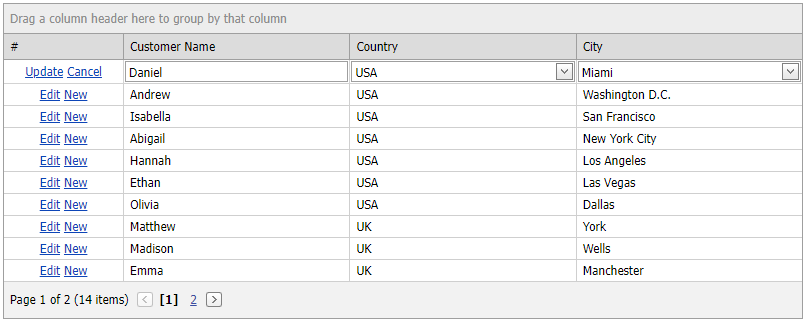

<!-- default badges list -->

[](https://supportcenter.devexpress.com/ticket/details/E3689)
[](https://docs.devexpress.com/GeneralInformation/403183)
<!-- default badges end -->
# Grid View for ASP.NET Web Forms - Cascading Combo Boxes

This example demonstrates how to implement cascading combo box editors within [ASPxGridView](https://docs.devexpress.com/AspNet/DevExpress.Web.ASPxGridView).



## Setup the Grid and its Column Editors

Create an [ASPxGridView](https://docs.devexpress.com/AspNet/DevExpress.Web.ASPxGridView) control, assign its data source, and set the grid's [edit mode](https://docs.devexpress.com/AspNet/DevExpress.Web.ASPxGridViewEditingSettings.Mode) to `Inline`. Add two columns of the [GridViewDataComboBoxColumn](https://docs.devexpress.com/AspNet/DevExpress.Web.GridViewDataComboBoxColumn) type and specify their data sources.

```xml
<dx:ASPxGridView ID="Grid" runat="server" AutoGenerateColumns="false" DataSourceID="Customers"
    KeyFieldName="CustomerID" ClientInstanceName="grid">
    <Columns>
        <%--...--%>
        <dx:GridViewDataComboBoxColumn Caption="Country" FieldName="CountryID">
            <PropertiesComboBox DataSourceID="Countries" ValueField="CountryID" ValueType="System.Int32"
                <%--...--%>
            </PropertiesComboBox>
        </dx:GridViewDataComboBoxColumn>
        <dx:GridViewDataComboBoxColumn Caption="City" FieldName="CityID">
            <PropertiesComboBox DataSourceID="AllCities" ValueField="CityID" ValueType="System.Int32"
                <%--...--%>
            </PropertiesComboBox>
        </dx:GridViewDataComboBoxColumn>
    </Columns>
    <SettingsEditing Mode="Inline" />
</dx:ASPxGridView>
<asp:ObjectDataSource ID="Customers" runat="server" ... />
<asp:ObjectDataSource ID="Countries" runat="server" ... />
<asp:ObjectDataSource ID="AllCities" runat="server" ... />
```

## Respond to a Selection Change on the Client Side

Handle the primary editor's client-side [SelectedIndexChanged](https://docs.devexpress.com/AspNet/js-ASPxClientComboBox.SelectedIndexChanged) event. In this event handler, get the editor value (the [GetValue](https://docs.devexpress.com/AspNet/js-ASPxClientEditBase.GetValue) method) and pass it as a parameter in the [PerformCallback](https://docs.devexpress.com/AspNet/js-ASPxClientComboBox.PerformCallback(parameter)) method of the secondary editor. To access the secondary editor, call the [GetEditor](https://docs.devexpress.com/AspNet/js-ASPxClientGridView.GetEditor(column)) method.

```xml
<dx:ASPxGridView ID="Grid" runat="server" ... >
    <Columns>
        <%--...--%>
        <dx:GridViewDataComboBoxColumn Caption="Country" FieldName="CountryID" ...>
            <PropertiesComboBox DataSourceID="Countries" ValueField="CountryID" ...>
                <ClientSideEvents SelectedIndexChanged="CountriesCombo_SelectedIndexChanged" />
            </PropertiesComboBox>
        </dx:GridViewDataComboBoxColumn>
        <dx:GridViewDataComboBoxColumn Caption="City" FieldName="CityID" ... />
    </Columns>
</dx.ASPxGridView>
```

```js
function CountriesCombo_SelectedIndexChanged(s, e) {
    grid.GetEditor("CityID").PerformCallback(s.GetValue());
}
```

## Filter the Secondary Combo Box Values on the Server Side

In the [CellEditorInitialize](https://docs.devexpress.com/AspNet/DevExpress.Web.ASPxGridView.CellEditorInitialize) event handler, access the secondary editor and add a handler to its [Callback](https://docs.devexpress.com/AspNet/DevExpress.Web.ASPxCallback.Callback) event. In the handler, use the [Parameter](https://docs.devexpress.com/AspNet/DevExpress.Web.CallbackEventArgsBase.Parameter) argument property to obtain the primary editor's value from the client side. Filter the secondary editor's data source based on this value and bind the filtered values to the editor.

```c#
protected void Grid_CellEditorInitialize(object sender, ASPxGridViewEditorEventArgs e) {
    if(e.Column.FieldName == "CityID") {
        var combo = (ASPxComboBox)e.Editor;
        combo.Callback += new CallbackEventHandlerBase(combo_Callback);

        var grid = e.Column.Grid;
        if (!combo.IsCallback) {
            var countryID = -1;
            if (!grid.IsNewRowEditing)
                countryID = (int)grid.GetRowValues(e.VisibleIndex, "CountryID");
            FillCitiesComboBox(combo, countryID);
        }
    }
}

private void combo_Callback(object sender, CallbackEventArgsBase e) {
    var countryID = -1;
    Int32.TryParse(e.Parameter, out countryID);
    FillCitiesComboBox(sender as ASPxComboBox, countryID);
}

protected void FillCitiesComboBox(ASPxComboBox combo, int countryID) {
    combo.DataSourceID = "Cities";
    Cities.SelectParameters["CountryID"].DefaultValue = countryID.ToString();
    combo.DataBindItems();

    combo.Items.Insert(0, new ListEditItem("", null)); // Null Item
}
```

## Documentation
- [ASPxGridView](https://docs.devexpress.com/AspNet/DevExpress.Web.ASPxGridView)
- [SelectedIndexChanged](https://docs.devexpress.com/AspNet/js-ASPxClientComboBox.SelectedIndexChanged)
- [GridViewDataComboBoxColumn](https://docs.devexpress.com/AspNet/DevExpress.Web.GridViewDataComboBoxColumn)
- [PerformCallback](https://docs.devexpress.com/AspNet/js-ASPxClientComboBox.PerformCallback(parameter)) 
- [Callback](https://docs.devexpress.com/AspNet/DevExpress.Web.ASPxCallback.Callback)
- [CellEditorInitialize](https://docs.devexpress.com/AspNet/DevExpress.Web.ASPxGridView.CellEditorInitialize)

## Files to Look At

* [DataProvider.cs](./CS/WebSite/App_Code/DataProvider.cs) (VB: [DataProvider.vb](./VB/WebSite/App_Code/DataProvider.vb))
* [Default.aspx](./CS/WebSite/Default.aspx) (VB: [Default.aspx](./VB/WebSite/Default.aspx))
* [Default.aspx.cs](./CS/WebSite/Default.aspx.cs) (VB: [Default.aspx.vb](./VB/WebSite/Default.aspx.vb))

## More Examples
- [Cascading Editors Demo](https://demos.devexpress.com/ASPxGridViewDemos/GridEditing/CascadingComboBoxes.aspx)
- [ASPxGridView - How to implement cascading comboboxes in Batch Edit mode](https://github.com/DevExpress-Examples/aspxgridview-how-to-implement-cascading-comboboxes-in-batch-edit-mode-t124512)
- [MVC ComboBox Extension - Cascading Combo Boxes](https://github.com/DevExpress-Examples/mvc-combobox-extension-cascading-combo-boxes-e2844)
